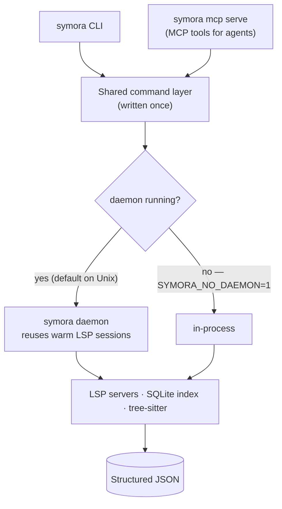
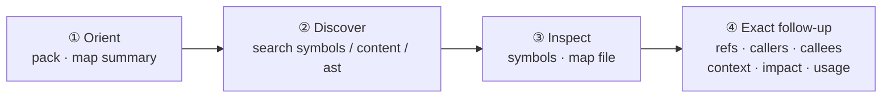

<picture>
  <source media="(prefers-color-scheme: dark)" srcset="assets/symora_black.png">
  <source media="(prefers-color-scheme: light)" srcset="assets/symora_white.png">
  
</picture>

# Symora

**Read a codebase the way a compiler does — by symbol, not by string.** Symora is a CLI that answers "where is this defined", "who calls this", and "what breaks if I change this" with precise, structured JSON, built for AI coding agents and scripts.

[](https://github.com/junyeong-ai/symora/actions)
[](https://www.rust-lang.org)
[](https://github.com/junyeong-ai/symora)

**English** | [한국어](README.md)

---

## What is Symora?

Grep finds *text*. Symora finds *meaning*. It combines four engines behind one CLI:

- **LSP semantics** — real definitions, references, and call hierarchy from the same language servers your editor uses (rust-analyzer, pyright, typescript-language-server, gopls, and more).
- **SQLite symbol/content index** — millisecond fuzzy search across the whole repo, persistent on disk.
- **tree-sitter AST search** — structural pattern matching, no language server required.
- **A reusable daemon** — keeps language-server sessions warm so repeated calls stay fast.

Every command prints JSON by default, so an agent or a shell script can parse the answer instead of re-reading files.

---

## Why Symora?

A coding agent (or a new teammate) constantly asks the same questions. Text search answers them slowly and noisily. Symora answers them exactly:

| Question | Command |
| --- | --- |
| What's the shape of this repo? | `symora map summary` |
| Where is `processOrder` defined? | `symora search symbols processOrder` |
| What does this symbol do, in context? | `symora context <file:line> --all` |
| Who calls it? | `symora callers <file:line>` |
| What breaks if I change it? | `symora impact <file:line>` |
| Change it safely (preview first) | `symora edit replace-body … --dry-run` |

---

## Quick start

```bash
# 1. Install (prebuilt binary, SHA-256 verified)
curl -fsSL https://raw.githubusercontent.com/junyeong-ai/symora/main/scripts/install.sh | bash

# 2. Build the search index for the current project (once)
cd your-project && symora search index build

# 3. Ask questions
symora map summary                          # repo overview
symora search symbols AuthService           # find a symbol
symora context src/auth/service.ts:42 --all # everything about it
symora impact src/auth/service.ts:42        # blast radius of a change
```

LSP-backed commands also need the matching language server. Check with `symora doctor <lang>` and install with the command it prints.

---

## How it works

One command layer serves two surfaces (CLI and MCP) and runs against either a warm daemon or in-process — the result is identical either way.



- **Two backends, different needs.** Index and `search ast`/`map` work with no language server. The LSP-backed commands (`refs`, `callers`, `context`, `impact`, `rename`, …) need the server for the target language — and degrade *honestly* (a structured `unsupported` response) when a server lacks a capability, never a silently-wrong answer.
- **The daemon is automatic.** On Unix, Symora keeps language-server sessions warm across invocations so the second call is fast. Set `SYMORA_NO_DAEMON=1` to run in-process.

---

## The exploration flow

Symora is designed to move from a *rough* idea to an *exact* answer:



The walkthrough below follows exactly this path.

---

## Walkthrough — landing in an unfamiliar codebase

Say you just cloned **`shopflow`**, a TypeScript e-commerce backend you've never seen, and your task is *"add an empty-cart guard to checkout."* Here's the whole loop. (Examples use a fictional project; the JSON shapes are exactly what Symora emits.)

### ① Orient — what is this repo?

```bash
symora map summary
```
```json
{
  "root": "/home/dev/shopflow",
  "total_files": 84,
  "code_files": 71,
  "support_files": 13,
  "test_files": 18,
  "directories": 12,
  "languages": [
    { "language": "typescript", "file_count": 67, "test_files": 18 },
    { "language": "json", "file_count": 4, "test_files": 0 }
  ],
  "top_directories": [
    { "path": "src/services", "file_count": 14, "test_files": 0 },
    { "path": "src/routes", "file_count": 9, "test_files": 0 },
    { "path": "tests", "file_count": 18, "test_files": 18 }
  ],
  "entrypoints": [
    { "file": "src/server.ts", "reason": "main entry file" },
    { "file": "src/app.ts", "reason": "application bootstrap candidate" }
  ],
  "next_commands": [
    "symora map file src/server.ts --related-limit 5",
    "symora symbols src/server.ts --depth 1"
  ]
}
```
> 67 TypeScript files, most logic under `src/services`, and `entrypoints` already points at where execution starts. `symora pack --tokens 4000` gives a deeper, PageRank-ranked brief when you want one.

### ② Discover — where is checkout handled?

```bash
symora search symbols processOrder
```
```json
{
  "count": 1,
  "showing": 1,
  "items": [
    {
      "name": "processOrder",
      "name_path": "CheckoutService/processOrder",
      "kind": "method",
      "file": "src/services/checkout.ts",
      "line": 48,
      "column": 9,
      "container": "CheckoutService",
      "backend": "index",
      "score": 1.0
    }
  ]
}
```
> Found it: `CheckoutService/processOrder` at `src/services/checkout.ts:48`. Every list response shares the same shape — `count` (total), `showing` (emitted), `items`.

### ③ Understand it in context

One call gathers the body, references, callers, callees, related types, and tests:

```bash
symora context src/services/checkout.ts:48 --all
```
```json
{
  "target": {
    "name": "processOrder",
    "kind": "method",
    "file": "src/services/checkout.ts",
    "line": 48,
    "signature": "async processOrder(cart: Cart, user: User): Promise<Order>",
    "body": "async processOrder(cart: Cart, user: User): Promise<Order> {\n    const reserved = await this.inventory.reserve(cart.items);\n    const order = await this.payment.charge(user, cart.total);\n    return this.orders.create(order, reserved);\n  }"
  },
  "refs":    { "total": 5, "test": 3, "prod": 2, "files": 3, "modules": 3, "is_exported": true },
  "callers": { "count": 2, "showing": 2, "items": [ /* handleCheckout, runOrderQueue */ ] },
  "callees": { "count": 3, "showing": 3, "items": [ /* reserve, charge, create */ ] },
  "types":   { "count": 3, "showing": 3, "items": [ /* Cart, User, Order */ ] },
  "tests":   { "count": 1, "showing": 1, "items": [ /* checkout.test.ts */ ] }
}
```
> You now see the implementation, that it's exported, hit from 3 files, and covered by 1 test — without opening a single file.

### ④ Who calls it?

```bash
symora callers src/services/checkout.ts:48
```
```json
{
  "count": 2,
  "showing": 2,
  "items": [
    {
      "name": "handleCheckout",
      "location":  { "file": "src/routes/checkout.ts", "line": 23, "column": 14 },
      "call_site": { "file": "src/routes/checkout.ts", "line": 31, "column": 28 }
    },
    {
      "name": "runOrderQueue",
      "location":  { "file": "src/jobs/orderWorker.ts", "line": 67, "column": 16 },
      "call_site": { "file": "src/jobs/orderWorker.ts", "line": 72, "column": 30 }
    }
  ]
}
```
> Two entry points: the HTTP route and a background job. `location` is where the caller is declared; `call_site` is the exact line that calls your symbol.

### ⑤ What breaks if I change it?

```bash
symora impact src/services/checkout.ts:48 --depth 2
```
```json
{
  "target": { "name": "processOrder", "kind": "method", "file": "src/services/checkout.ts", "line": 48 },
  "refs": { "total": 5, "test": 3, "prod": 2, "files": 3, "modules": 3, "is_exported": true },
  "coverage": { "count": 1, "files": ["tests/checkout.test.ts"] },
  "files": [
    { "file": "src/routes/checkout.ts",  "is_test": false, "refs": 1 },
    { "file": "src/jobs/orderWorker.ts", "is_test": false, "refs": 1 },
    { "file": "tests/checkout.test.ts",  "is_test": true,  "refs": 3 }
  ],
  "blast_radius": {
    "direct_callers": 2,
    "transitive_callers": 4,
    "depth": 2,
    "max_depth_reached": true,
    "callers_by_depth": [
      { "depth": 1, "count": 2, "test": 0, "prod": 2 },
      { "depth": 2, "count": 2, "test": 0, "prod": 2 }
    ],
    "test_coverage_ratio": 0.5,
    "risk": "high",
    "confidence": 0.8
  },
  "next_commands": ["symora impact src/services/checkout.ts:48 --depth 3"]
}
```
> `risk: "high"` with only half the call sites under test — change carefully. `next_commands` are ready-to-run follow-ups, emitted only when they'd help.

### ⑥ Make the change — preview before you write

```bash
symora edit replace-body src/services/checkout.ts --symbol 'CheckoutService/processOrder' \
  --body "$(cat new_processOrder.ts)" --dry-run
```
```json
{
  "operation": "replace_body",
  "file": "src/services/checkout.ts",
  "target_symbol": "CheckoutService/processOrder",
  "target_kind": "method",
  "lines": { "start": 48, "end": 71 },
  "bytes_changed": 84,
  "dry_run": true,
  "preview": "@@ -48,6 +48,8 @@\n   async processOrder(cart: Cart, user: User): Promise<Order> {\n+    if (cart.items.length === 0) throw new EmptyCartError();\n     const reserved = await this.inventory.reserve(cart.items);\n     ..."
}
```
> `--dry-run` shows the exact hunk and writes nothing. Drop it to apply, or add `--verify-callers` to pull diagnostics on the two call sites afterward. Prefer `--symbol` over a line number — it re-resolves against the live file, so sequential edits don't go stale.

> **Addressing is forgiving but safe.** `--symbol` matches a bare name, a `Class/method` suffix, a `*/method` wildcard, or the exact `name_path`. When a name is ambiguous, `edit` refuses rather than guess:
> ```json
> { "error": { "code": "invalid_argument",
>   "message": "Symbol path 'reserve' matches 2 symbols in src/services/inventory.ts",
>   "hint": "Candidates: InventoryService/reserve (method) line 34, ReservationPool/reserve (method) line 88. Target one by file:line[:col] instead." } }
> ```

---

## Command groups

```bash
# Discovery (index + tree-sitter; no language server needed)
symora search symbols AuthUser              # fuzzy symbol search
symora search symbols AuthUser --workspace-symbols   # force live LSP, skip the index
symora search content "async function"      # ranked full-text search
symora search ast '(class_declaration) @c' --lang typescript   # structural AST match
symora pack --tokens 4000                   # token-budgeted, PageRank-ranked repo brief

# Project & file overview
symora map summary                          # repo shape
symora map file src/services/checkout.ts    # one file: symbols, siblings, related files
symora map dir src/services                 # directory listing
symora map related src/services/checkout.ts # heuristic "what to read next"

# Symbols & inspection (LSP)
symora symbols src/services/checkout.ts --depth 2   # full symbol tree
symora symbols src/services/checkout.ts --body      # tree + source bodies
symora symbols src/services/checkout.ts --symbol 'CheckoutService/processOrder'
symora symbols --symbol 'CheckoutService/processOrder' --body   # workspace-wide (index-backed), no file needed
symora symbols --name processOrder --lang ts        # find a method across the workspace, one language
symora def src/services/checkout.ts:48:9            # go to definition
symora hover src/services/checkout.ts:48:9          # type / signature
symora signature src/services/checkout.ts:55:20     # signature help at a call

# Navigation (LSP)
symora refs src/services/checkout.ts:48             # all references
symora callers src/services/checkout.ts:48          # incoming calls
symora callees src/services/checkout.ts:48          # outgoing calls
symora callees src/services/checkout.ts:48 --depth 3            # reachable set
symora callees src/services/checkout.ts:48 --to src/db/orders.ts:12   # shortest call chain
symora typedef … / implementations … / supertypes … / subtypes …

# Context & impact (LSP)
symora context src/services/checkout.ts:48 --all    # body + refs + callers + callees + types + tests
symora context src/services/checkout.ts:48 --with-bodies   # also attach callee/type bodies
symora usage processOrder --lang typescript         # usage sites by name or location
symora impact src/services/checkout.ts:48           # change blast radius
symora diff-impact                                  # impact of the current git diff

# Edit & refactor (mutations preview with --dry-run)
symora edit replace-body <file> --symbol 'Class/method' --body "$(cat new.ts)" --dry-run
symora edit insert-before / insert-after / delete / replace / pattern
symora rename src/services/checkout.ts:48:9 settleOrder --dry-run
symora actions list src/services/checkout.ts:48:9   # available code actions
symora format src/services/checkout.ts              # LSP format

# Health & diagnostics
symora doctor                # language servers: verified serving / missing + install commands
symora diagnostics src/services/checkout.ts --with-context --with-suggestions
symora status                # project + daemon state
```

Global flags go *before* the subcommand: `symora --format compact search symbols X` (single-line JSON), `symora -q rename …` (errors only), `symora -v status` (verbose).

---

## The output contract

Every command is built for machine parsing, and the rules are stable:

- **List responses** share one shape: `count` (total found), `showing` (emitted), `items`, plus — only when relevant — `truncated`, `stale`, `hints`, `next_commands`, and `indexing`.
- **Command failures** are structured JSON and exit non-zero:
  ```json
  { "error": { "code": "server_not_installed", "message": "…", "hint": "…" } }
  ```
  `code` and `message` are always present; `hint` only when there's an actionable next step. Common `code` values: `not_found`, `invalid_argument`, `unsupported`, `conflict`, `precondition_failed`, `server_not_installed`, `lsp_unavailable`, `timeout`. Two things sit outside this: a bad CLI argument prints a plain usage error and exits 2, and a clean "nothing found" (e.g. `def` on a position with no definition) is `{ "message": … }` at exit 0 — absence is not an error.
- **Positions are 1-indexed** on both input and output. Snapping commands (`refs`, `callers`, `callees`, `context`, `impact`, `usage`, `edit`) take `file:line:column` or a column-less `file:line` that addresses the symbol declared on that line; position-exact commands (`def`, `hover`, `typedef`, `rename`, `actions`) use the literal column. Emitted locations always carry line and column.
- **Degradation is disclosed, never hidden.** `indexing: "timed_out"` means a count is a lower bound; `coverage_gaps` lists languages that couldn't be searched; an `unsupported` error names the missing LSP capability and points to an alternative.
- **`--format compact`** emits single-line JSON; piping to a non-TTY keeps full JSON.

---

## Search index

Symora keeps a persistent SQLite index at `.symora/store.db` in each project.

```bash
symora search index build               # incremental: only changed files, prunes deleted
symora search index build --force --lang rust
symora search index status              # languages covered, symbol_count, file_count, last_indexed
symora search index clear
```

Search degrades gracefully without an index (it falls back to a filesystem scan or live LSP), but a built index is the fastest, most reliable path for repeated use. `--force` is only for a full rebuild.

---

## Configuration

Precedence: `.symora/config.toml` → `~/.config/symora/config.toml` → built-in defaults.

```bash
symora config init            # write a local config
symora config init --global   # write the user config
```

Common settings: LSP timeouts and limits, daemon behavior, test-file patterns, and per-language server overrides:

```toml
[lsp.servers.typescript]
command = "/Users/me/.nvm/versions/node/v20.11.0/bin/typescript-language-server"
args = ["--stdio"]   # optional; absent = inherit built-in args
tier = "slow"        # optional; one of fast | standard | slow
```

The key is the `language` id printed by `symora doctor`. A rejected key is reported in doctor's `config_errors` and never silently applied. The daemon reads config at startup, so run `symora daemon restart` after editing it.

File discovery follows the project's `.gitignore` (root and nested, with full per-directory semantics), plus an optional `.symora/ignore` — gitignore syntax — for symora-only exclusions. When a project ships no root `.gitignore`, common dependency and build directories (`node_modules`, `target`, `dist`, …) are skipped by default. Hidden entries (dotfiles and dot-directories) are always skipped and, like ripgrep and fd, cannot be re-included by a `.gitignore` negation — this is what keeps `.git` and `.symora` out unconditionally.

---

## Installation

One-shot install — no prompts. Downloads the prebuilt binary (SHA-256 verified, source build where no prebuilt exists) and installs the Claude Code skill:

```bash
curl -fsSL https://raw.githubusercontent.com/junyeong-ai/symora/main/scripts/install.sh | bash
```

Useful variants:

```bash
# Binary only, skip the Claude Code skill
curl -fsSL .../install.sh | bash -s -- --no-skill

# Pin a release / verify GitHub build provenance (needs the gh CLI)
curl -fsSL .../install.sh | bash -s -- --version <version> --verify-attestations

# Source build (builds the release tag from git; no checkout needed)
curl -fsSL .../install.sh | bash -s -- --source

# Guided prompts (method, skill) — works even piped through curl
curl -fsSL .../install.sh | bash -s -- --interactive

# Change install location
curl -fsSL .../install.sh | SYMORA_INSTALL_DIR=/usr/local/bin bash
```

Prebuilt targets: macOS Apple Silicon, Linux x86_64 (gnu), Linux aarch64 (gnu). Platforms without a prebuilt (Intel Macs, etc.) fall back to a source build automatically (requires Rust). Inside a checkout, `cargo install --path .` works too.

The binary owns the rest of its lifecycle:

```bash
symora setup                          # interactive: skill + language servers
symora setup skill                    # skill only
symora setup deps --group core        # dependencies only (core / core-jvm / core-web / core-systems / all)
symora self update                    # in-place upgrade to the latest release
symora self update --version <version>
symora self uninstall                 # remove binary + skill + config + daemon data
```

---

## MCP server

Symora also runs as a Model Context Protocol server. A curated subset of commands — navigation, analysis, and edit tools — is exposed as MCP tools that share the same in-process command layer, so the MCP and CLI results match.

```bash
symora setup mcp                     # auto-detect and wire installed hosts (Claude Code, Codex)
symora setup mcp --dry-run           # show the plan without writing
symora setup mcp --host claude_code  # a specific host only
symora setup mcp --uninstall         # disconnect (removes only the entry it wrote)

symora mcp serve                                 # stdio (Claude Code, Cursor, etc.)
symora mcp serve --transport http --port 7700    # HTTP

symora mcp tools                                 # tool catalog as JSON (schemas and mutation annotations)
symora mcp tools --profile read-only             # what a read-only server would expose
```

`mcp tools` prints the same catalog `tools/list` serves, so a machine-readable capability inventory is available without starting a server — input schemas on every tool, output schemas on the list-shaped ones, and a tool's output schema also describes the JSON the matching CLI command emits. Mutating tools are marked twice — the word `Mutates` in the description and `annotations.readOnlyHint: false` — and all support `dry_run`. The server's `initialize` response carries the full usage playbook (tool sequencing, edit addressing, error recovery), so a connected agent needs no extra setup.

---

## For AI agents

The agent-facing playbook ships *with the tool*, not in this README, so it stays in lockstep with the binary:

- `symora setup skill` installs the Claude Code skill (the full CLI playbook).
- `symora mcp serve` returns the same guidance through the MCP `initialize` instructions.

The short version: discovery flows from rough (`pack`, `map summary`, `search symbols`) to exact (`symbols`, `context`, `refs`, `impact`); list responses share one shape; positions are 1-indexed; command failures are structured `{code, message, hint}` at non-zero exit (a bad CLI argument is a plain usage error).

---

## Platform notes

- **Linux** and **macOS**: supported.
- **Windows**: the daemon workflow is unsupported (Symora uses Unix domain sockets).

On Unix the daemon is on by default (`SYMORA_NO_DAEMON=1` forces in-process). The mode is chosen once at startup — there is no runtime fallback. `daemon start` and `daemon restart` launch in the background and return immediately.

```bash
symora daemon start | stop | restart | status
```

---

## Command reference

| Group | Commands |
| --- | --- |
| **Discover** | `search symbols`, `search content`, `search ast`, `search nodes`, `pack` |
| **Map** | `map summary`, `map file`, `map dir`, `map related` |
| **Inspect** | `symbols`, `def`, `hover`, `signature` |
| **Navigate** | `refs`, `callers`, `callees`, `typedef`, `implementations`, `supertypes`, `subtypes` |
| **Analyze** | `context`, `usage`, `impact`, `diff-impact` |
| **Edit** | `edit {replace-body,insert-before,insert-after,delete,replace,pattern}`, `rename`, `actions`, `format` |
| **Diagnose** | `diagnostics`, `inlay-hints`, `folding`, `selection`, `code-lens` |
| **Manage** | `search index`, `doctor`, `status`, `init`, `config`, `daemon`, `setup`, `self`, `mcp`, `bench` |

Run `symora <command> --help` for flags and the full output shape of any command.

> `search semantic` (natural-language search) exists only in builds compiled with the optional `embeddings` feature; a default build reports `unsupported`.

---

## Troubleshooting

| Symptom | Fix |
| --- | --- |
| `count: 0` from `search …` | `symora search index status`; an empty `languages` means no build has completed — run `symora search index build`. A language absent from it was answered by a language server, not the index. |
| `server_not_installed` | `symora doctor <lang>` and install per its `install` field, or point `[lsp.servers.<lang>]` at an existing binary, then `symora daemon restart`. `installed: true` with `serves: false` means the binary resolves but does not run — usually a version-manager shim; run it directly to see why. |
| `indexing: "timed_out"` | The language server is still warming up — the count is a lower bound. Retry once it's warm. |
| `conflict` from `edit`/`rename` | The file changed since it was analyzed — re-read it and retry with fresh coordinates. Recoverable. |
| Stale results after edits | `symora search index build` (incremental), or `symora daemon restart`. |
| Debugging | `symora -v <command>` for verbose logs. |

---

## Links

- [Developer guide](CLAUDE.md)
- [GitHub repository](https://github.com/junyeong-ai/symora)

---

<div align="center">

**English** | [한국어](README.md)

Made with Rust 🦀

</div>
