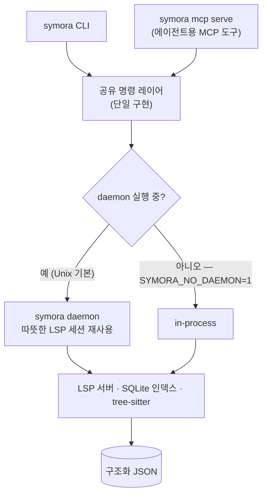
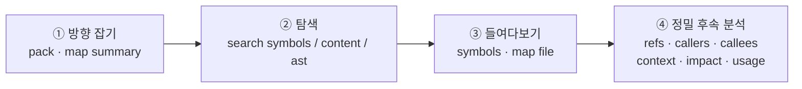

<picture>
  <source media="(prefers-color-scheme: dark)" srcset="assets/symora_black.png">
  <source media="(prefers-color-scheme: light)" srcset="assets/symora_white.png">
  
</picture>

# Symora

**컴파일러처럼 코드베이스를 읽으세요 — 문자열이 아니라 심볼 단위로.** Symora는 "이게 어디 정의돼 있지", "누가 이걸 호출하지", "이걸 바꾸면 뭐가 깨지지" 같은 질문에 정확한 구조화 JSON으로 답하는 CLI입니다. AI 코딩 에이전트와 스크립트를 위해 설계됐습니다.

[](https://github.com/junyeong-ai/symora/actions)
[](https://www.rust-lang.org)
[](https://github.com/junyeong-ai/symora)

[English](README.en.md) | **한국어**

---

## Symora란?

grep은 *문자열*을 찾고, Symora는 *의미*를 찾습니다. 하나의 CLI 뒤에 네 가지 엔진을 결합합니다.

- **LSP 의미 분석** — 에디터가 쓰는 바로 그 language server(rust-analyzer, pyright, typescript-language-server, gopls 등)에서 실제 정의·참조·호출 계층을 가져옵니다.
- **SQLite 심볼/콘텐츠 인덱스** — 저장소 전체를 밀리초 단위로 fuzzy 검색하며, 디스크에 지속됩니다.
- **tree-sitter AST 검색** — language server 없이 구조적 패턴 매칭.
- **재사용 daemon** — language server 세션을 따뜻하게 유지해 반복 호출을 빠르게.

모든 명령은 기본적으로 JSON을 출력하므로, 에이전트나 셸 스크립트가 파일을 다시 읽는 대신 답을 바로 파싱할 수 있습니다.

---

## 왜 Symora인가?

코딩 에이전트(또는 새로 합류한 팀원)는 늘 같은 질문을 반복합니다. 텍스트 검색은 느리고 노이즈가 많지만, Symora는 정확히 답합니다.

| 질문 | 명령 |
| --- | --- |
| 이 저장소의 구조는? | `symora map summary` |
| `processOrder`는 어디 정의돼 있지? | `symora search symbols processOrder` |
| 이 심볼은 맥락 속에서 뭘 하지? | `symora context <file:line> --all` |
| 누가 호출하지? | `symora callers <file:line>` |
| 바꾸면 뭐가 깨지지? | `symora impact <file:line>` |
| 안전하게 바꾸기(먼저 미리보기) | `symora edit replace-body … --dry-run` |

---

## 빠른 시작

```bash
# 1. 설치 (사전 빌드 바이너리, SHA-256 검증)
curl -fsSL https://raw.githubusercontent.com/junyeong-ai/symora/main/scripts/install.sh | bash

# 2. 현재 프로젝트의 검색 인덱스 빌드 (한 번)
cd your-project && symora search index build

# 3. 질문하기
symora map summary                          # 저장소 개요
symora search symbols AuthService           # 심볼 찾기
symora context src/auth/service.ts:42 --all # 그 심볼의 모든 것
symora impact src/auth/service.ts:42        # 변경 영향 범위
```

LSP 기반 명령은 해당 언어의 language server가 필요합니다. `symora doctor <lang>`로 확인하고, 출력에 나온 명령으로 설치하세요.

---

## 동작 방식

하나의 명령 레이어가 두 표면(CLI와 MCP)을 제공하고, 따뜻한 daemon 또는 in-process로 실행됩니다 — 결과는 어느 쪽이든 동일합니다.



- **두 백엔드, 다른 요구.** 인덱스와 `search ast`/`map`은 language server가 필요 없습니다. LSP 기반 명령(`refs`, `callers`, `context`, `impact`, `rename` 등)은 대상 언어의 서버가 필요하며, 서버가 어떤 기능을 지원하지 않으면 *정직하게* (구조화된 `unsupported` 응답으로) 격하됩니다 — 절대 조용히 틀린 답을 주지 않습니다.
- **daemon은 자동.** Unix에서는 호출 간에 language server 세션을 따뜻하게 유지해 두 번째 호출부터 빠릅니다. `SYMORA_NO_DAEMON=1`로 in-process 실행할 수 있습니다.

---

## 탐색 흐름

Symora는 *대략적인* 감에서 *정확한* 답으로 이동하도록 설계됐습니다.



아래 워크스루가 정확히 이 경로를 따릅니다.

---

## 워크스루 — 낯선 코드베이스에 떨어졌을 때

처음 보는 TypeScript 전자상거래 백엔드 **`shopflow`**를 막 클론했고, 작업은 *"체크아웃에 빈 장바구니 가드 추가"*라고 해봅시다. 전체 루프는 다음과 같습니다. (예시는 가상 프로젝트지만, JSON 형태는 Symora가 실제로 내보내는 그대로입니다.)

### ① 방향 잡기 — 이 저장소는 뭐지?

```bash
symora map summary
```
```json
{
  "root": "/home/dev/shopflow",
  "total_files": 84,
  "code_files": 71,
  "support_files": 13,
  "test_files": 18,
  "directories": 12,
  "languages": [
    { "language": "typescript", "file_count": 67, "test_files": 18 },
    { "language": "json", "file_count": 4, "test_files": 0 }
  ],
  "top_directories": [
    { "path": "src/services", "file_count": 14, "test_files": 0 },
    { "path": "src/routes", "file_count": 9, "test_files": 0 },
    { "path": "tests", "file_count": 18, "test_files": 18 }
  ],
  "entrypoints": [
    { "file": "src/server.ts", "reason": "main entry file" },
    { "file": "src/app.ts", "reason": "application bootstrap candidate" }
  ],
  "next_commands": [
    "symora map file src/server.ts --related-limit 5",
    "symora symbols src/server.ts --depth 1"
  ]
}
```
> TypeScript 67개 파일, 로직 대부분이 `src/services`에 있고 `entrypoints`가 실행 시작점을 바로 짚어 줍니다. 더 깊은 브리핑이 필요하면 `symora pack --tokens 4000`이 PageRank 순위로 정리해 줍니다.

### ② 탐색 — 체크아웃은 어디서 처리되지?

```bash
symora search symbols processOrder
```
```json
{
  "count": 1,
  "showing": 1,
  "items": [
    {
      "name": "processOrder",
      "name_path": "CheckoutService/processOrder",
      "kind": "method",
      "file": "src/services/checkout.ts",
      "line": 48,
      "column": 9,
      "container": "CheckoutService",
      "backend": "index",
      "score": 1.0
    }
  ]
}
```
> 찾았습니다: `src/services/checkout.ts:48`의 `CheckoutService/processOrder`. 모든 리스트 응답은 동일한 형태를 공유합니다 — `count`(전체), `showing`(출력 수), `items`.

### ③ 맥락 속에서 이해하기

한 번의 호출로 본문·참조·호출자·피호출자·관련 타입·테스트를 모읍니다.

```bash
symora context src/services/checkout.ts:48 --all
```
```json
{
  "target": {
    "name": "processOrder",
    "kind": "method",
    "file": "src/services/checkout.ts",
    "line": 48,
    "signature": "async processOrder(cart: Cart, user: User): Promise<Order>",
    "body": "async processOrder(cart: Cart, user: User): Promise<Order> {\n    const reserved = await this.inventory.reserve(cart.items);\n    const order = await this.payment.charge(user, cart.total);\n    return this.orders.create(order, reserved);\n  }"
  },
  "refs":    { "total": 5, "test": 3, "prod": 2, "files": 3, "modules": 3, "is_exported": true },
  "callers": { "count": 2, "showing": 2, "items": [ /* handleCheckout, runOrderQueue */ ] },
  "callees": { "count": 3, "showing": 3, "items": [ /* reserve, charge, create */ ] },
  "types":   { "count": 3, "showing": 3, "items": [ /* Cart, User, Order */ ] },
  "tests":   { "count": 1, "showing": 1, "items": [ /* checkout.test.ts */ ] }
}
```
> 이제 구현, export 여부, 3개 파일에서 호출됨, 테스트 1개로 커버됨을 — 파일을 한 개도 열지 않고 — 파악했습니다.

### ④ 누가 호출하지?

```bash
symora callers src/services/checkout.ts:48
```
```json
{
  "count": 2,
  "showing": 2,
  "items": [
    {
      "name": "handleCheckout",
      "location":  { "file": "src/routes/checkout.ts", "line": 23, "column": 14 },
      "call_site": { "file": "src/routes/checkout.ts", "line": 31, "column": 28 }
    },
    {
      "name": "runOrderQueue",
      "location":  { "file": "src/jobs/orderWorker.ts", "line": 67, "column": 16 },
      "call_site": { "file": "src/jobs/orderWorker.ts", "line": 72, "column": 30 }
    }
  ]
}
```
> 진입점 두 곳: HTTP 라우트와 백그라운드 잡. `location`은 호출자가 선언된 위치, `call_site`는 내 심볼을 호출하는 정확한 라인입니다.

### ⑤ 바꾸면 뭐가 깨지지?

```bash
symora impact src/services/checkout.ts:48 --depth 2
```
```json
{
  "target": { "name": "processOrder", "kind": "method", "file": "src/services/checkout.ts", "line": 48 },
  "refs": { "total": 5, "test": 3, "prod": 2, "files": 3, "modules": 3, "is_exported": true },
  "coverage": { "count": 1, "files": ["tests/checkout.test.ts"] },
  "files": [
    { "file": "src/routes/checkout.ts",  "is_test": false, "refs": 1 },
    { "file": "src/jobs/orderWorker.ts", "is_test": false, "refs": 1 },
    { "file": "tests/checkout.test.ts",  "is_test": true,  "refs": 3 }
  ],
  "blast_radius": {
    "direct_callers": 2,
    "transitive_callers": 4,
    "depth": 2,
    "max_depth_reached": true,
    "callers_by_depth": [
      { "depth": 1, "count": 2, "test": 0, "prod": 2 },
      { "depth": 2, "count": 2, "test": 2, "prod": 0 }
    ],
    "test_coverage_ratio": 0.5,
    "risk": "high",
    "confidence": 0.9
  },
  "next_commands": ["symora impact src/services/checkout.ts:48 --depth 3"]
}
```
> 호출 지점의 절반만 테스트되는데 `risk: "high"` — 조심해서 바꿔야 합니다. `next_commands`는 도움이 될 때만 나오는, 바로 실행 가능한 후속 명령입니다.

### ⑥ 변경 — 쓰기 전에 미리보기

```bash
symora edit replace-body src/services/checkout.ts --symbol 'CheckoutService/processOrder' \
  --body "$(cat new_processOrder.ts)" --dry-run
```
```json
{
  "operation": "replace_body",
  "file": "src/services/checkout.ts",
  "target_symbol": "CheckoutService/processOrder",
  "target_kind": "method",
  "lines": { "start": 48, "end": 71 },
  "bytes_changed": 84,
  "dry_run": true,
  "preview": "@@ -48,6 +48,8 @@\n   async processOrder(cart: Cart, user: User): Promise<Order> {\n+    if (cart.items.length === 0) throw new EmptyCartError();\n     const reserved = await this.inventory.reserve(cart.items);\n     ..."
}
```
> `--dry-run`은 정확한 hunk를 보여주고 아무것도 쓰지 않습니다. 적용하려면 빼면 되고, `--verify-callers`를 붙이면 변경 후 두 호출 지점의 진단까지 가져옵니다. 라인 번호보다 `--symbol`을 권장합니다 — 라이브 파일에 다시 해석되므로 연속 편집에도 좌표가 어긋나지 않습니다.

> **주소 지정은 유연하지만 안전합니다.** `--symbol`은 단순 이름, `Class/method` suffix, `*/method` 와일드카드, 또는 정확한 `name_path`로 매칭됩니다. 이름이 모호하면 `edit`은 추측하지 않고 거부합니다.
> ```json
> { "error": { "code": "invalid_argument",
>   "message": "Symbol path 'reserve' matches 2 symbols in src/services/inventory.ts",
>   "hint": "Candidates: InventoryService/reserve (method) line 34, ReservationPool/reserve (method) line 88. Target one by file:line[:col] instead." } }
> ```

---

## 명령 그룹

```bash
# 탐색 (인덱스 + tree-sitter; language server 불필요)
symora search symbols AuthUser              # fuzzy 심볼 검색
symora search symbols AuthUser --workspace-symbols   # 인덱스 건너뛰고 라이브 LSP 강제
symora search content "async function"      # 순위가 매겨진 전문 검색
symora search ast '(class_declaration) @c' --lang typescript   # 구조적 AST 매칭
symora pack --tokens 4000                   # 토큰 예산 기반, PageRank 순위 저장소 브리핑

# 프로젝트 & 파일 개요
symora map summary                          # 저장소 형태
symora map file src/services/checkout.ts    # 한 파일: 심볼·형제·관련 파일
symora map dir src/services                 # 디렉터리 목록
symora map related src/services/checkout.ts # 휴리스틱 "다음에 읽을 것"

# 심볼 & 들여다보기 (LSP)
symora symbols src/services/checkout.ts --depth 2   # 전체 심볼 트리
symora symbols src/services/checkout.ts --body      # 트리 + 소스 본문
symora symbols src/services/checkout.ts --symbol 'CheckoutService/processOrder'
symora symbols --symbol 'CheckoutService/processOrder' --body   # 파일 없이 워크스페이스 전역(인덱스 기반)
symora symbols --name processOrder --lang ts        # 워크스페이스에서 메서드 찾기 (단일 언어)
symora def src/services/checkout.ts:48:9            # 정의로 이동
symora hover src/services/checkout.ts:48:9          # 타입 / 시그니처
symora signature src/services/checkout.ts:55:20     # 호출 지점 시그니처 도움말

# 네비게이션 (LSP)
symora refs src/services/checkout.ts:48             # 모든 참조
symora callers src/services/checkout.ts:48          # 들어오는 호출
symora callees src/services/checkout.ts:48          # 나가는 호출
symora callees src/services/checkout.ts:48 --depth 3            # 도달 가능 집합
symora callees src/services/checkout.ts:48 --to src/db/orders.ts:12   # 최단 호출 체인
symora typedef … / implementations … / supertypes … / subtypes …

# 컨텍스트 & 영향 (LSP)
symora context src/services/checkout.ts:48 --all    # 본문 + 참조 + 호출자/피호출자 + 타입 + 테스트
symora context src/services/checkout.ts:48 --with-bodies   # 피호출자/타입 본문도 첨부
symora usage processOrder --lang typescript         # 이름 또는 위치로 사용처
symora impact src/services/checkout.ts:48           # 변경 영향 범위
symora diff-impact                                  # 현재 git diff의 영향

# 편집 & 리팩터링 (변경 작업은 --dry-run으로 미리보기)
symora edit replace-body <file> --symbol 'Class/method' --body "$(cat new.ts)" --dry-run
symora edit insert-before <file> --symbol 'Class/method' --code "// note"
symora edit insert-after  <file> --symbol 'Class/method' --code "// note"
symora edit delete        <file> --symbol 'Class/method' --expect-no-references
symora edit replace       <file>:10 --end <file>:12 --text "new lines"
symora edit pattern       <file> --pattern '(function_item) @f' --lang rust --text "…"
symora rename src/services/checkout.ts:48:9 settleOrder --dry-run
symora actions list src/services/checkout.ts:48:9   # 가능한 코드 액션
symora format src/services/checkout.ts              # LSP 포맷

# 상태 & 진단
symora doctor                # language server: 실제 동작 여부(serves) / 누락 + 설치 명령
symora diagnostics src/services/checkout.ts --with-context --with-suggestions
symora status                # 프로젝트 + language server 상태 (daemon은 `symora daemon status`)
```

전역 플래그는 서브커맨드 앞뒤 어디든 둘 수 있습니다: `symora --format compact search symbols X`(단일 라인 JSON), `symora -q rename …`(에러만), `symora -v status`(verbose). `--workspace <name>`과 `--token-estimate`도 전역입니다.

---

## 출력 계약

모든 명령은 기계 파싱을 위해 설계됐고, 규칙은 안정적입니다.

- **리스트 응답**은 하나의 형태를 공유합니다: `count`(전체 발견), `showing`(출력), `items`, 그리고 — 관련될 때만 — `truncated`, `stale`, `hints`, `next_commands`, `indexing`, `bodies_included`, `coverage_gaps`, `error`.
- **명령 실패**는 구조화 JSON이고 0이 아닌 코드로 종료합니다.
  ```json
  { "error": { "code": "server_not_installed", "message": "…", "hint": "…" } }
  ```
  `code`와 `message`는 항상 있고, `hint`는 실행 가능한 다음 단계가 있을 때만 붙습니다. 흔한 `code` 값: `not_found`, `invalid_argument`, `unsupported`, `conflict`, `precondition_failed`, `server_not_installed`, `lsp_unavailable`, `timeout`. 두 가지는 예외입니다: 잘못된 CLI 인자는 평문 usage 에러를 출력하고 exit 2로, "찾지 못함"의 정상 결과(예: 정의 없는 위치의 `def`)는 `{ "message": … }` + exit 0으로 — 부재는 에러가 아닙니다.
- **위치는 1-indexed** — 입력과 출력 모두. snapping 명령(`refs`, `callers`, `callees`, `context`, `impact`, `usage`, `edit`)은 `file:line:column` 또는 컬럼 생략 `file:line`(그 줄에 선언된 심볼을 지정)을 받고, position-exact 명령(`def`, `hover`, `typedef`, `rename`, `actions`)은 컬럼을 그대로 사용합니다. 출력 위치는 항상 line과 column을 함께 담습니다.
- **격하는 숨기지 않고 공개됩니다.** `indexing: "timed_out"`는 count가 하한임을 뜻하고, `coverage_gaps`는 검색하지 못한 언어를 나열하며, `unsupported` 에러는 빠진 LSP 기능을 지목하고 대안을 알려줍니다.
- **`--format compact`**는 단일 라인 JSON을 출력합니다. 모든 응답은 형식과 무관하게 `output.max_response_chars`(기본 20,000자)로 상한이 걸립니다: 항목 단위로 통째로 잘리고, `truncated`와 설정 키를 지목하는 hint로 공개됩니다 — compact는 더 촘촘한 인코딩이라 같은 상한 아래 더 많은 항목을 담습니다.

---

## 검색 인덱스

Symora는 각 프로젝트의 `.symora/store.db`에 지속성 SQLite 인덱스를 둡니다.

```bash
symora search index build               # 증분: 변경된 파일만, 삭제된 파일 정리
symora search index build --force --lang rust
symora search index status              # languages(커버 언어), 심볼/파일/라인 수, 크기, last_indexed
symora search index clear
```

인덱스가 없어도 검색은 우아하게 격하됩니다(파일시스템 스캔 또는 라이브 LSP로 폴백). 다만 반복 사용에는 빌드된 인덱스가 가장 빠르고 안정적입니다. `--force`는 전체 재빌드에만 사용하세요.

---

## 설정

우선순위: `.symora/config.toml` → `~/.config/symora/config.toml`(`XDG_CONFIG_HOME` 존중) → 기본값. 두 환경 변수 `SYMORA_SEARCH_LIMIT`, `SYMORA_LSP_TIMEOUT`은 파일보다 우선합니다.

```bash
symora config init            # 로컬 설정 작성
symora config init --global   # 사용자 설정 작성
```

주요 설정: LSP timeout·limit, daemon 동작, 테스트 파일 패턴, 언어별 서버 오버라이드.

```toml
[lsp.servers.typescript]
command = "/Users/me/.nvm/versions/node/v20.11.0/bin/typescript-language-server"
args = ["--stdio"]   # 생략 가능; 없으면 기본 args 상속
tier = "slow"        # 생략 가능; fast | standard | slow 중 하나
```

키는 `symora doctor`가 출력하는 `language` id입니다. 잘못된 키는 doctor의 `config_errors`로 보고되며 조용히 적용되지 않습니다. daemon은 시작 시 설정을 읽으므로, 변경 후 `symora daemon restart`를 실행하세요.

파일 탐색은 프로젝트의 `.gitignore`(루트·중첩, 디렉터리별 시맨틱 완전 지원)를 따르며, symora 전용 제외는 `.symora/ignore`(gitignore 문법)로 추가할 수 있습니다. 루트 `.gitignore`가 없으면 흔한 의존성·빌드 디렉터리(`node_modules`, `target`, `dist` …)를 기본 제외합니다. 숨김 항목(도트파일·도트디렉터리)은 ripgrep·fd와 동일하게 항상 제외되며 `.gitignore` negation으로도 재포함되지 않습니다 — 이것이 `.git`·`.symora`를 무조건 배제하는 근거입니다.

---

## 설치

한 줄 설치 — 프롬프트 없음. 사전 빌드 바이너리(SHA-256 검증, 사전 빌드가 없는 플랫폼은 소스 빌드)를 내려받고 Claude Code 스킬까지 설치합니다:

```bash
curl -fsSL https://raw.githubusercontent.com/junyeong-ai/symora/main/scripts/install.sh | bash
```

유용한 변형:

```bash
# 바이너리만 (Claude Code 스킬 생략)
curl -fsSL .../install.sh | bash -s -- --no-skill

# 특정 버전 핀 / GitHub build provenance 검증 (gh CLI 필요)
curl -fsSL .../install.sh | bash -s -- --version <version> --verify-attestations

# 소스 빌드 (체크아웃 없이 릴리스 태그를 git에서 빌드)
curl -fsSL .../install.sh | bash -s -- --source

# 안내형 프롬프트 (설치 방법, 스킬) — curl 파이프에서도 동작
curl -fsSL .../install.sh | bash -s -- --interactive

# 설치 위치 변경
curl -fsSL .../install.sh | SYMORA_INSTALL_DIR=/usr/local/bin bash
```

사전 빌드 타깃: macOS Apple Silicon, Linux x86_64 (gnu), Linux aarch64 (gnu). 사전 빌드가 없는 플랫폼(Intel Mac 등)은 자동으로 소스 빌드로 진행합니다(Rust 필요). 체크아웃 안에서는 `cargo install --path .`도 됩니다.

나머지 lifecycle은 바이너리가 소유합니다.

```bash
symora setup                          # 대화형: 스킬 + language server
symora setup skill                    # 스킬만
symora setup deps --group core        # 의존성만 (core / core-jvm / core-web / core-systems / all)
symora self update                    # 최신 릴리스로 in-place 업그레이드
symora self update --version <version>
symora self uninstall                 # 바이너리 + 스킬 + 설정 + daemon 데이터 제거
```

---

## MCP 서버

Symora는 Model Context Protocol 서버로도 동작합니다. 선별된 명령 집합 — 네비게이션·분석·편집 도구 — 이 MCP 도구로 노출되며, CLI와 동일한 in-process 명령 레이어를 공유하므로 두 표면의 결과가 일치합니다.

```bash
symora setup mcp                     # 설치된 호스트 자동 감지·연결 (Claude Code, Codex)
symora setup mcp --dry-run           # 변경 없이 계획만 출력
symora setup mcp --host claude_code  # 특정 호스트만
symora setup mcp --uninstall         # 연결 해제 (자신이 만든 항목만 제거)

symora mcp serve                                 # stdio (Claude Code, Cursor 등)
symora mcp serve --transport http --port 7700    # HTTP

symora mcp tools                                 # 도구 카탈로그를 JSON으로 (스키마·mutation 표시 포함)
symora mcp tools --profile read-only             # read-only 서버가 노출할 목록
```

`mcp tools`는 `tools/list`가 서빙하는 것과 동일한 카탈로그를 출력하므로, 서버를 띄우지 않고도 기계가 읽을 수 있는 능력 목록을 얻을 수 있습니다 — 입력 스키마는 모든 도구에, 출력 스키마는 리스트형 응답 도구에 실리며, 출력 스키마는 대응하는 CLI 명령의 JSON에도 그대로 적용됩니다. 소스를 수정하는 도구는 두 곳에 표시되고(description의 `Mutates`, `annotations.readOnlyHint: false`) 모두 `dry_run`을 지원합니다. 서버의 `initialize` 응답에는 전체 사용 플레이북(도구 호출 순서, 편집 주소 지정, 오류 복구)이 포함되므로, 연결된 에이전트는 추가 설정이 필요 없습니다.

---

## AI 에이전트를 위해

에이전트용 플레이북은 이 README가 아니라 *도구와 함께* 배포되어 바이너리와 항상 일치합니다.

- `symora setup skill`은 Claude Code 스킬(전체 CLI 플레이북)을 설치합니다.
- `symora mcp serve`는 같은 내용을 MCP 도구 어휘로 옮긴 가이드를 `initialize` instructions로 반환합니다.

요약하면: 탐색은 대략적(`pack`, `map summary`, `search symbols`)에서 정밀(`symbols`, `context`, `refs`, `impact`)로 흐르고, 리스트 응답은 하나의 형태를 공유하며, 위치는 1-indexed이고, 명령 실패는 0이 아닌 코드로 종료하는 구조화된 `{code, message, hint}`입니다(잘못된 CLI 인자는 평문 usage 에러).

---

## 플랫폼 참고

- **Linux**, **macOS**: 지원.
- **Windows**: daemon 워크플로 미지원 (Unix domain socket 사용).

Unix에서는 daemon이 기본 켜짐(`SYMORA_NO_DAEMON=1`이면 in-process 강제). 모드는 시작 시 한 번 결정되며 런타임 폴백은 없습니다. `daemon start`/`daemon restart`는 백그라운드에서 띄우고 즉시 반환합니다.

```bash
symora daemon start | stop | restart | status
```

---

## 명령어 참조

| 그룹 | 명령 |
| --- | --- |
| **탐색** | `search symbols`, `search content`, `search ast`, `search nodes`, `pack` |
| **맵** | `map summary`, `map file`, `map dir`, `map related` |
| **들여다보기** | `symbols`, `def`, `hover`, `signature` |
| **네비게이션** | `refs`, `callers`, `callees`, `typedef`, `implementations`, `supertypes`, `subtypes` |
| **분석** | `context`, `usage`, `impact`, `diff-impact` |
| **편집** | `edit {replace-body,insert-before,insert-after,delete,replace,pattern}`, `rename`, `actions`, `format` |
| **진단** | `diagnostics`, `inlay-hints`, `folding`, `selection`, `code-lens` |
| **관리** | `search index`, `doctor`, `status`, `init`, `config`, `daemon`, `setup`, `self`, `mcp`, `bench` |

어떤 명령이든 `symora <command> --help`로 플래그와 전체 출력 형태를 볼 수 있습니다.

> `search semantic`(자연어 검색)은 선택적 `embeddings` 피처로 빌드한 경우에만 동작하며, 기본 빌드에서는 `unsupported`를 반환합니다.

---

## 문제 해결

| 증상 | 해결 |
| --- | --- |
| `search …`가 `count: 0` | `symora search index status`; `languages`가 비었으면 빌드된 적이 없다는 뜻 — `symora search index build`. 검색한 언어가 목록에 없으면 그 답은 인덱스가 아니라 language server에서 온 것입니다. |
| `server_not_installed` | `symora doctor <lang>` 후 `install` 필드대로 설치, 또는 `[lsp.servers.<lang>]`를 기존 바이너리로 지정 후 `symora daemon restart`. `installed: true`인데 `serves: false`면 바이너리는 있으나 실행되지 않는 것(대개 버전 매니저 샴) — 직접 실행해 원인을 보세요. |
| `indexing: "timed_out"` | language server가 아직 워밍업 중 — count는 하한. 따뜻해진 뒤 재시도. |
| `edit`/`rename`의 `conflict` | 분석 이후 파일이 변경됨 — 다시 읽고 새 좌표로 재시도. 복구 가능. |
| 편집 후 결과가 stale | `symora search index build`(증분), 또는 `symora daemon restart`. |
| 디버깅 | `symora -v <command>`로 verbose 로그. |

---

## 링크

- [개발자 가이드](CLAUDE.md)
- [GitHub 저장소](https://github.com/junyeong-ai/symora)

---

<div align="center">

[English](README.en.md) | **한국어**

Made with Rust 🦀

</div>
